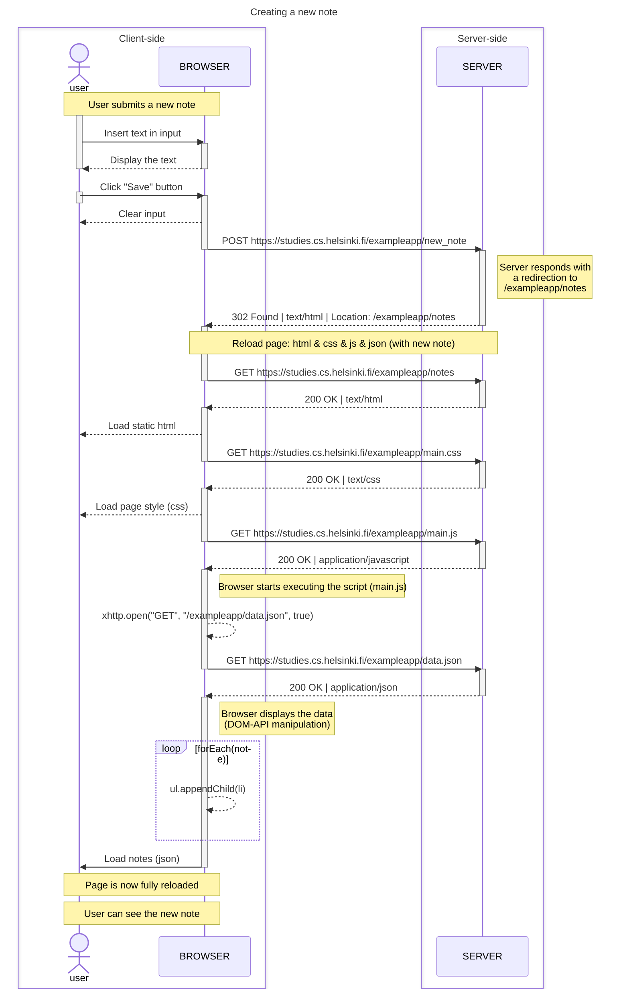

# 0.4 New note [ sequence diagram ]

```mermaid
sequenceDiagram
    title Creating a new note

    box Client-side
        actor U as user
        participant B as BROWSER
    end
    box Server-side
        participant S as SERVER
    end

    %% User-browser interaction (submition)

    Note over U,B: User submits a new note
    activate U
    U->>B: Insert text in input
    activate B
    B-->>U: Display the text
    deactivate B
    deactivate U

    U->>B: Click "Save" button
    activate U
    deactivate U
    activate B
    B-->>U: Clear input


    %% Browser sends the request POST

    B->>S: POST https://studies.cs.helsinki.fi/exampleapp/new_note
    deactivate B
    activate S
    Note right of S: Server responds with <br/>a redirection to <br/>/exampleapp/notes
    S-->>B: 302 Found | text/html | Location: /exampleapp/notes
    deactivate S
    activate B


    %% Browser sends the request GET (html)

    Note over B,S: Reload page: html & css & js & json (with new note)
    B->>S: GET https://studies.cs.helsinki.fi/exampleapp/notes
    deactivate B
    activate S
    S-->>B: 200 OK | text/html
    deactivate S
    activate B
    B-->>U: Load static html


    %% Browser sends the request GET (css)

    B->>S: GET https://studies.cs.helsinki.fi/exampleapp/main.css
    deactivate B
    activate S
    S-->>B: 200 OK | text/css
    deactivate S
    activate B
    B-->>U: Load page style (css)


    %% Browser sends the request GET (js)

    B->>S: GET https://studies.cs.helsinki.fi/exampleapp/main.js
    deactivate B
    activate S
    S-->>B: 200 OK | application/javascript
    deactivate S
    activate B
    Note right of B: Browser starts executing the script (main.js)
    B-->>B: xhttp.open("GET", "/exampleapp/data.json", true)


    %% Browser sends the request GET (json)

    B->>S: GET https://studies.cs.helsinki.fi/exampleapp/data.json
    deactivate B
    activate S
    S-->>B: 200 OK | application/json
    deactivate S
    activate B
    Note right of B: Browser displays the data <br/>(DOM-API manipulation)

    loop forEach(note)
        B-->>B: ul.appendChild(li)
    end

    B->>U: Load notes (json)
    deactivate B

    Note over U,B: Page is now fully reloaded
    Note over U,B: User can see the new note
```
