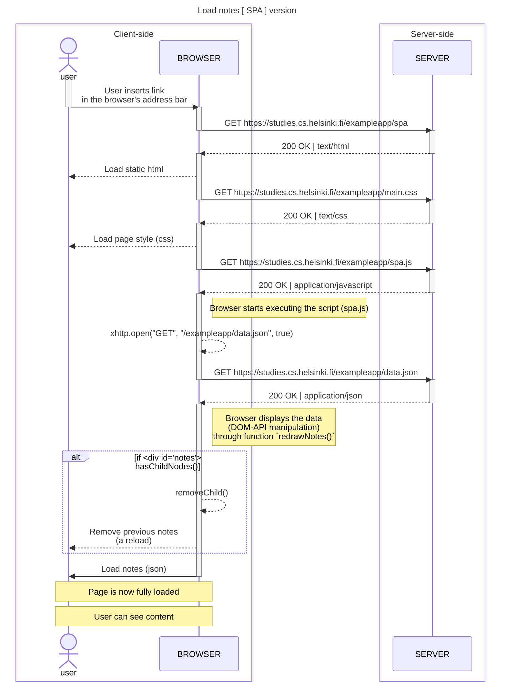

# 0.5 Load notes SPA [ sequence diagram ]

```mermaid
sequenceDiagram
    title Load notes [ SPA ] version

    box Client-side
        actor U as user
        participant B as BROWSER
    end
    box Server-side
        participant S as SERVER
    end

    %% User-browser interaction (search page)

    activate U
    U->>B: User inserts link <br/>in the browser's address bar
    deactivate U
    activate B


    %% Browser sends the request GET (html)

    B->>S: GET https://studies.cs.helsinki.fi/exampleapp/spa
    deactivate B
    activate S
    S-->>B: 200 OK | text/html
    deactivate S
    activate B
    B-->>U: Load static html


    %% Browser sends the request GET (css)

    B->>S: GET https://studies.cs.helsinki.fi/exampleapp/main.css
    deactivate B
    activate S
    S-->>B: 200 OK | text/css
    deactivate S
    activate B
    B-->>U: Load page style (css)


    %% Browser sends the request GET (js)

    B->>S: GET https://studies.cs.helsinki.fi/exampleapp/spa.js
    deactivate B
    activate S
    S-->>B: 200 OK | application/javascript
    deactivate S
    activate B
    Note right of B: Browser starts executing the script (spa.js)
    B-->>B: xhttp.open("GET", "/exampleapp/data.json", true)


    %% Browser sends the request GET (json)

    B->>S: GET https://studies.cs.helsinki.fi/exampleapp/data.json
    deactivate B
    activate S
    S-->>B: 200 OK | application/json
    deactivate S
    activate B
    Note right of B: Browser displays the data <br/>(DOM-API manipulation) <br/>through function `redrawNotes()`

    alt if <div id="notes"> hasChildNodes()
        B-->>B: removeChild()
        B-->>U: Remove previous notes <br/>(a reload)
    end

    B->>U: Load notes (json)
    deactivate B

    Note over U,B: Page is now fully loaded
    Note over U,B: User can see content
```
