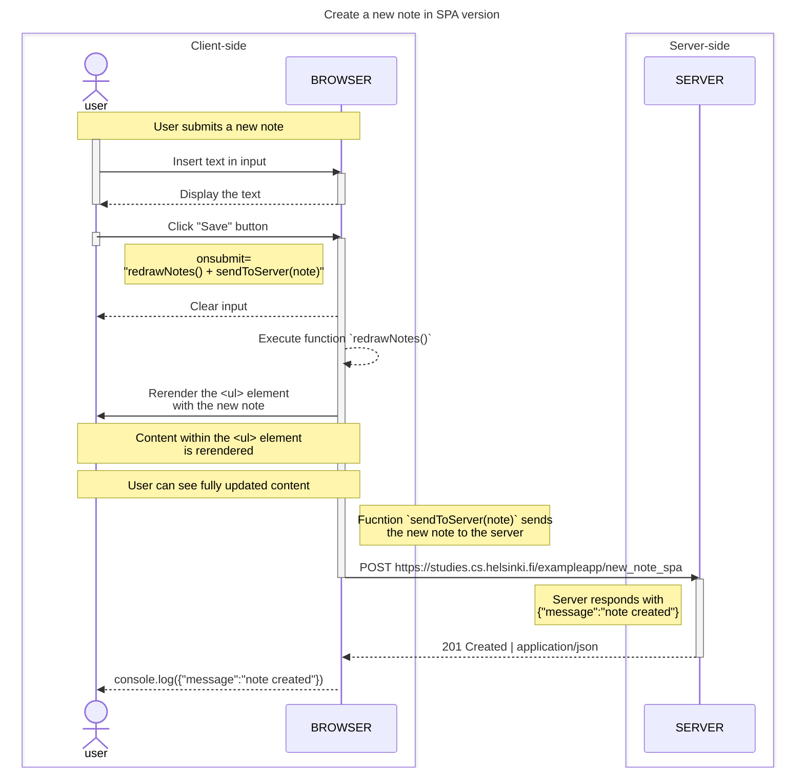

# 0.6 New note in SPA [ sequence diagram ]

```mermaid
sequenceDiagram
    title Create a new note in SPA version

    box Client-side
        actor U as user
        participant B as BROWSER
    end
    box Server-side
        participant S as SERVER
    end

    %% User-browser interaction (submition)

    Note over U,B: User submits a new note
    activate U
    U->>B: Insert text in input
    activate B
    B-->>U: Display the text
    deactivate B
    deactivate U

    U->>B: Click "Save" button
    activate U
    deactivate U
    activate B
    Note left of B: onsubmit=<br/>"redrawNotes() + sendToServer(note)"
    B-->>U: Clear input

    B-->>B: Execute function `redrawNotes()`
    B->>U: Rerender the <ul> element <br/>with the new note

    Note over U,B: Content within the <ul> element <br/>is rerendered
    Note over U,B: User can see fully updated content


    %% Browser sends the request POST

    Note right of B: Fucntion `sendToServer(note)` sends <br/>the new note to the server

    B->>S: POST https://studies.cs.helsinki.fi/exampleapp/new_note_spa
    deactivate B
    activate S
    Note left of S: Server responds with <br/>{"message":"note created"}
    S-->>B: 201 Created | application/json
    deactivate S
    activate B

    B-->>U: console.log({"message":"note created"})

```
