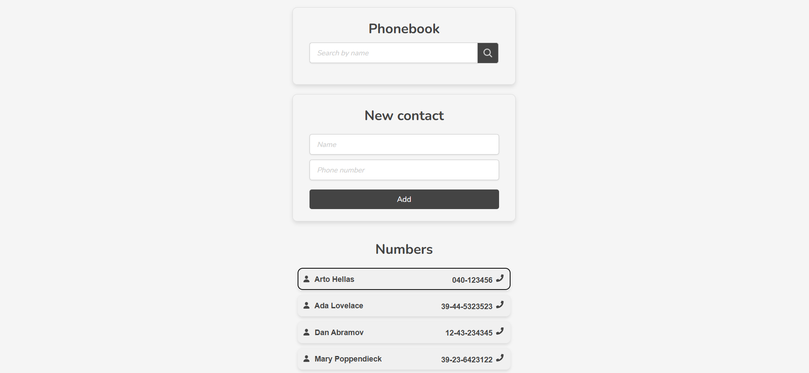
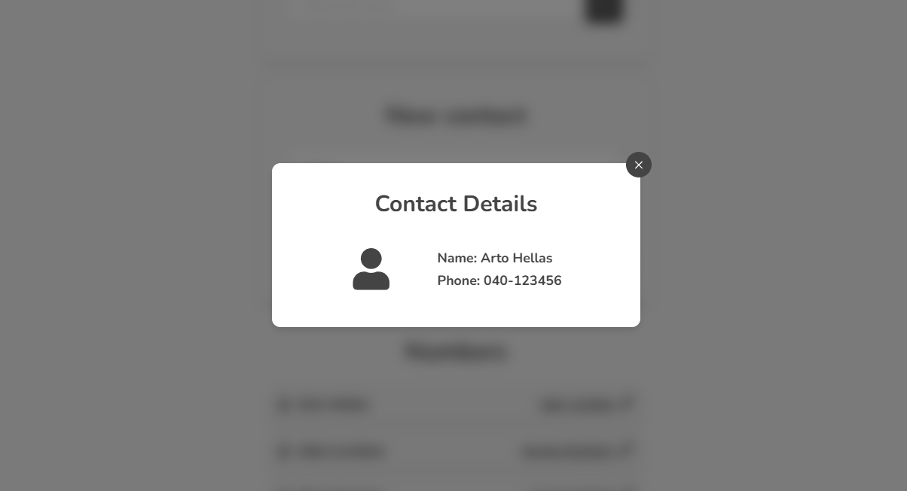

# Phonebook




This is a phonebook app built with React and styled-components. It allows users to add, edit, and delete contacts. The app also includes a search feature to filter contacts by name.

## Features

- Add, edit, and delete contacts
- Search contacts by name

## Getting Started

### Prerequisites

- Node.js
- npm

### Installation

1. Clone the repository
2. Navigate to the project directory
3. Install the dependencies

```bash
npm install
```

4. Start the development server

```bash
npm run dev
```

5. Open http://localhost:3000 in your browser

## Contributing

Contributions are welcome! Please follow these steps:

1. Fork the repository
2. Create a new branch for your feature or bug fix
3. Make your changes
4. Commit your changes with a clear and descriptive commit message
5. Push your changes to your forked repository
6. Create a pull request to the main repository with a clear and descriptive title

## License

This project is licensed under the MIT License. See the [LICENSE.md](LICENSE.md) file for more information.

## Acknowledgments

- The app uses the [React](https://reactjs.org/) library for building user interfaces.
- The app uses the [styled-components](https://styled-components.com/) library for styling components.
- The app uses the [React Icons](https://react-icons.github.io/react-icons/) library for icons.
