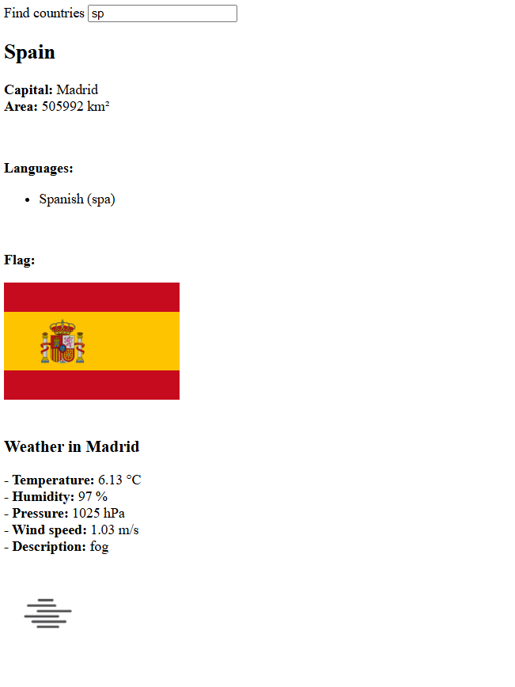

# Rest Countries



This is a simple app that fetches data from the [restcountries](https://studies.cs.helsinki.fi/restcountries/) API and displays the information in a list. The app also includes a search feature to filter countries by name. It also fetches weather data for the capital of each country and displays it in a separate section -> [Weather Data](https://studies.cs.helsinki.fi/weather-data/).

## Features

- Fetch and display country data from the restcountries API
- Fetch and display weather data for the capital of each country
- Search countries by name

## Getting Started

### Prerequisites

- Node.js
- npm
- VITE_WEATHER_API_KEY (get it from [OpenWeatherMap](https://openweathermap.org/)) This is an environment variable that is used to fetch weather data from the OpenWeatherMap API.

### Installation

1. Clone the repository
2. Navigate to the project directory
3. Install the dependencies

```bash
npm install
```

4. Create a .env file in the root directory and add your VITE_WEATHER_API_KEY

```
VITE_WEATHER_API_KEY=YOUR_API_KEY
```

5. Start the development server

```bash
npm run dev
```

6. Open http://localhost:3000 in your browser

## Contributing

Contributions are welcome! Please follow these steps:

1. Fork the repository
2. Create a new branch for your feature or bug fix
3. Make your changes
4. Commit your changes with a clear and descriptive commit message
5. Push your changes to your forked repository
6. Create a pull request to the main repository with a clear and descriptive title

## License

This project is licensed under the MIT License. See the [LICENSE.md](LICENSE.md) file for more information.

## Acknowledgments

- The app uses the [React](https://reactjs.org/) library for building user interfaces.
- The app uses the [Axios](https://axios-http.com/) library for making HTTP requests.
