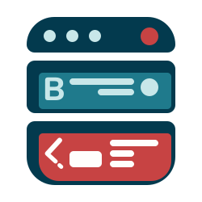
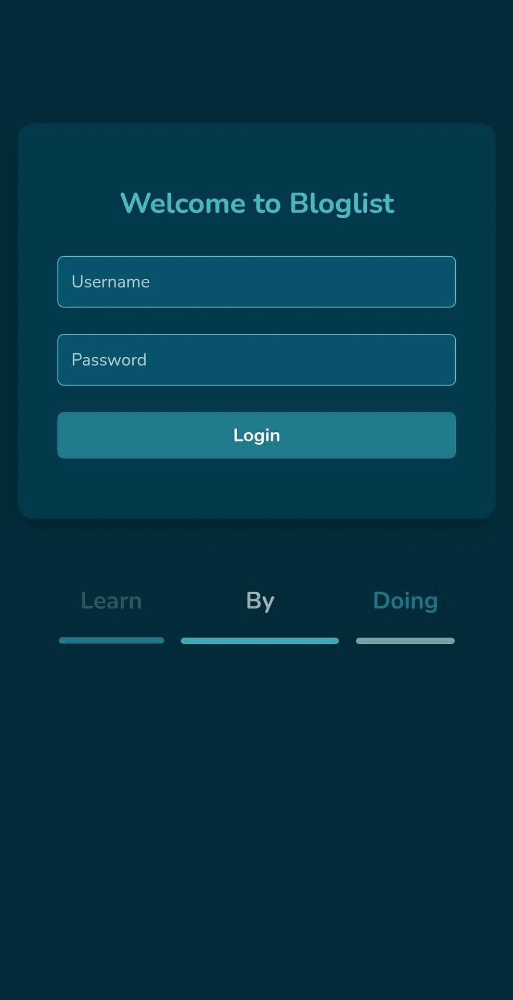

# <div style="display: flex; align-items: center; gap: 10px;">  BlogList </div>

BlogList is a **full-stack** web application designed to manage and interact with user-created blogs. It allows users to **create, like, and delete blogs**, with authentication and authorization mechanisms to ensure secure access. The project is built with a **React frontend, a Node.js backend, and a MongoDB database**.

## 🌍 Live Demo

_🚧 Deployment is planned for **Fly.io** (coming soon)._

---

## 📸 Screenshots

### **📱 Mobile View**



---

## 🚀 Features

### **Core Functionality**

✅ Users can **create, like, and delete** blogs  
✅ Blogs are **sorted by likes** in descending order  
✅ Secure **authentication & authorization** using JSON Web Tokens (JWT)  
✅ Responsive UI for both **desktop and mobile**  
✅ Search bar for filtering blogs by title  
✅ **Multilingual support** (English, Spanish, etc.)

### **Styling & UI**

🎨 Styled using **Styled Components** for responsiveness and modern design  
📱 Optimized for **mobile-first design**  
🌗 **Dark mode support** _(future implementation)_

### **Testing & Debugging**

🧪 **Unit & integration tests** using **Vitest & React Testing Library**  
📷 **End-to-end (E2E) tests** using **Playwright**  
🔍 **Mocking API requests** for efficient backend-independent testing

---

## 🛠️ Tech Stack

| **Technology** | **Description**                           |
| -------------- | ----------------------------------------- |
| **Frontend**   | React, Vite, React-Intl (i18n)            |
| **Styling**    | Tailwind CSS, Styled Components           |
| **Backend**    | Node.js, Express                          |
| **Database**   | MongoDB (Mongoose ORM)                    |
| **Auth**       | JWT (JSON Web Tokens)                     |
| **Testing**    | Vitest, Playwright, React Testing Library |
| **Deployment** | Fly.io _(planned)_                        |

---

## 🏗️ Installation & Setup

### **1️⃣ Clone the repository**

```sh
git clone https://github.com/yourusername/bloglist.git
cd bloglist
```

### **2️⃣ Install dependencies**

#### BACKEND

```sh
cd backend
npm install
```

#### FRONTEND

```sh
cd frontend
npm install
```

### **3️⃣ Set up environment variables**

Crate a `.env` file in the backend root and add:

```plaintext
MONGODB_URI=<your_mongodb_connection_url>
JWT_SECRET=<your_jwt_secret_key>
PORT=3003
```

### **4️⃣ Run the application**

#### Start Backend

```sh
npm run dev
```

#### Start Frontend

```sh
npm run dev
```

The frontend will be available at `http://localhost:5173`

The backend will be running on `http://localhost:3003/api`

## ⚙️ API Endpoints

| **Method** | **Endpoint**            | **Description**                   |
| ---------- | ----------------------- | --------------------------------- |
| **GET**    | `/api/blogs`            | Fetch all blogs                   |
| **POST**   | `/api/blogs`            | Create a new blog (requires auth) |
| **PUT**    | `/api/blogs/:id`        | Update blog likes                 |
| **DELETE** | `/api/blogs/:id`        | Delete a blog (only by owner)     |
| **POST**   | `/api/users`            | Create a new user                 |
| **GET**    | `/api/users`            | Fetch all users                   |
| **POST**   | `/api/login`            | Login user                        |
| **POST**   | `/api/testing/reset-db` | Reset the testing DB              |
| **GET**    | `/api/testing`          | Informative message               |

---

## 🔥 Testing Strategy

### 🧪 Unit & Integration Tests

- Uses **Vitest** and **React Testing Library**
- Tests include:
  - **Component rendering**
  - **State updates & event handling**
  - **Form validation & API calls**
  - **Full coverage analysis**

### 🎭 End-to-End (E2E) Tests

- Uses **Playwright** for simulating real user interactions:
  - **Logging in/out**
  - **Creating, liking, and deleting blogs**
  - **Sorting by likes**
  - **Multilingual support verification** (planned, not verified yet)
- Test results are recorded as **videos/screenshots** for debugging.

---

## 🔑 Authentication & Security

- ✅ **JWT-based authentication**
- ✅ **Token storage in localStorage**
- ✅ **Role-based access control (RBAC)**
- ✅ **Only blog owners can delete their blogs** (basic permissions)

---

## 🌍 Internationalization (i18n)

The application supports **multiple languages** using **React-Intl**.

### **Current supported languages:**

- 🇬🇧 **English** (default)
- 🇪🇸 **Spanish**
- 🇫🇷 **French**
- 🇩🇪 **German**
- 🇮🇹 **Italian**
- 🇨🇦 **Catalan**

The language can be switched via a **language selector** in the UI.

---

## 🏆 Future Improvements

- 🔹 **Dark Mode toggle**
- 🔹 **User profile management**
- 🔹 **Advanced search & filtering**
- 🔹 **More authentication options** (OAuth, Google Login, etc.)
- 🔹 **Deploy to Fly.io**

---

## 🤝 Contributing

Contributions are welcome! 🚀 If you’d like to improve this project, follow these steps:

1. **Fork the repository**
2. **Create a feature branch:**
   ```sh
   git checkout -b feature-new-feature
   ```
3. **Commit your changes:**
   ```sh
   git commit -m "Add new feature"
   ```
4. **Push to your branch:**
   ```sh
   git push origin feature-new-feature
   ```
5. **Create a Pull Request**

---

## 📝 License

This project is licensed under the **MIT License**.

---

## 📬 Contact

For any inquiries, feel free to reach out!

📧 **Email:** aggiovato@gmail.com

🐙 **GitHub:** [AGGIOVATO](https://github.com/aggiovato)

---
