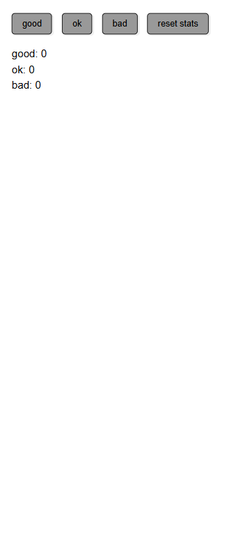
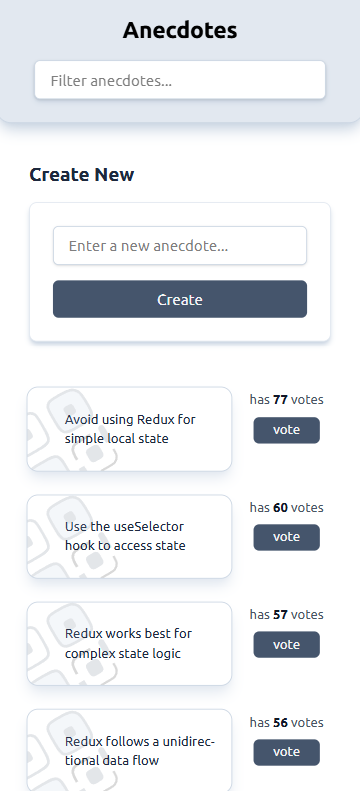
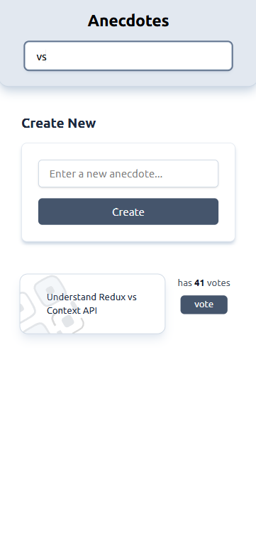
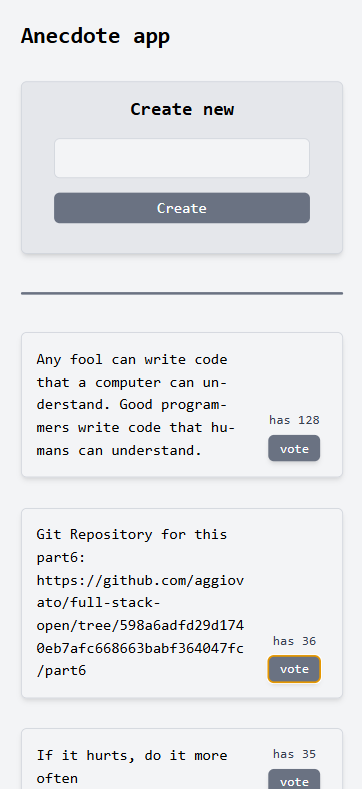
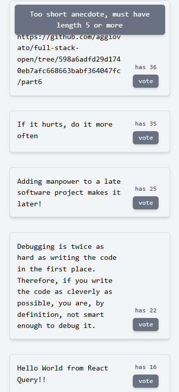

# 🚀 Part 6 - Redux, React Query & Context

## 📸 Mini Apps - Mobile Previews

```html
<div
  style="display: flex; flex-wrap: wrap; gap: 10px; justify-content: center;"
>
  
  
  
  
  
</div>
```

> 📌 **Note:** Make sure to place the images inside the `images/` folder within the project.

---

## 📂 **Projects in This Section**

### 1️⃣ **Query Anecdotes**

- Implementation of **React Query** for efficient global state management.
- Caching and automatic server synchronization.
- Optimized usage of `useQuery` and `useMutation` for better performance.

### 2️⃣ **Redux Anecdotes**

- Using **Redux Toolkit** to manage global state.
- Implementation of `createSlice` and `configureStore`.
- Middleware with **Redux Thunk** for handling async operations.

### 3️⃣ **Redux Counter**

- Building a simple counter app with **Redux**. (example from part6)
- Using `dispatch`, `useSelector`, and `useDispatch` for state manipulation.
- Implementing actions to increment and decrement values.

### 4️⃣ **Unicafe Redux**

- Developing a voting app using Redux.
- Handling **synchronous and asynchronous actions** with Redux Toolkit.
- Using `combineReducers` to modularize global state.

---

## 🚀 **Technologies Used**

- ✅ **React.js**
- ✅ **Redux Toolkit**
- ✅ **React Query**
- ✅ **Context API**
- ✅ **JSON Server for local storage**

💡 **This section was key to understanding how to manage global state efficiently in different scenarios.**

---

## 📜 **Installation Instructions**

Clone this repository and navigate to the project you want to run:

```sh
git clone https://github.com/your-repo/part6.git
cd query-anecdotes  # Or the desired project name
npm install
npm run dev
```
